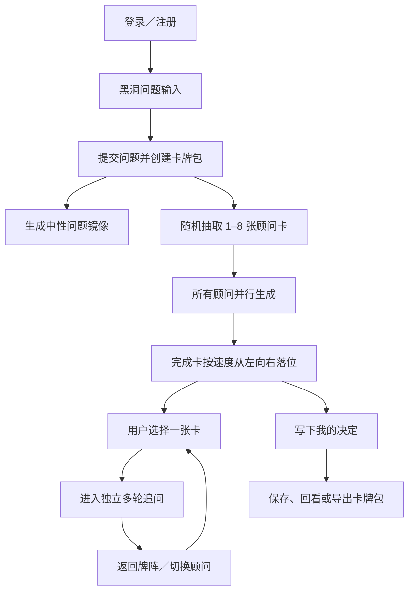
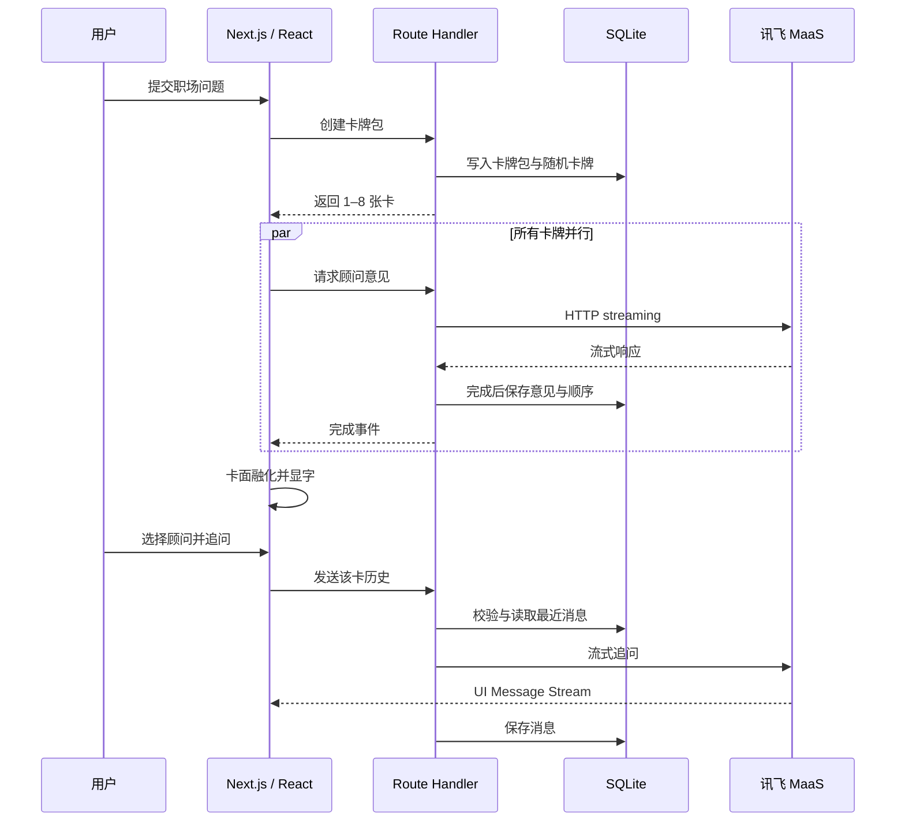

# 求知台

> 面向职场新人的多视角 AI 意见卡牌  
> 产品需求、交互设计、技术方案与实施计划

---

## 0. 文档信息

| 项目 | 内容 |
|---|---|
| 产品名称 | 求知台 |
| 产品形态 | PC 端单机／单服务器 AI Web 应用 |
| 目标用户 | 面临职场困惑、冲突和争议性选择的职场新人 |
| 核心输入 | 10–1,000 字的职场问题描述 |
| 核心输出 | 1–8 个互相独立、价值观不同的顾问意见及多轮追问 |
| 核心原则 | 多视角、不裁决、用户自己做决定 |
| 首期卡池 | 8 张固定顾问卡 |
| 默认抽取 | 完全随机抽取 4 张，可调整为 1–8 张 |
| 运行依赖 | 讯飞星辰 MaaS DeepSeek-V4-Pro |
| 数据存储 | 本机 SQLite |
| 视觉方向 | 抽象黑洞、引力卡轨、黑白金新构成主义、卡面融化显字 |
| 目标浏览器 | 最新版桌面 Chrome，页面宽度不低于 1,024px |
| 文档版本 | V2.0（需求确认版） |
| 文档状态 | 可进入开发 |

---

# 1. 产品定义

## 1.1 一句话定义

求知台是一款面向职场新人的多视角 AI 意见产品：用户把一个难以判断的职场问题投入黑洞，系统随机召集若干具有不同价值观的虚拟顾问，让他们独立给出意见并接受追问，最终由用户自己写下决定。

## 1.2 核心产品主张

> 求知台不提供唯一正确答案，而是让用户同时听见几个真正不同的答案。

## 1.3 第一性原理

用户咨询争议性职场问题时，核心诉求只有三项：

1. 看清并梳理自己正在面对的问题。
2. 获得来自不同价值排序的意见。
3. 保留决策权，最终自己选择。

因此，产品不应围绕知识搜索、问题分类或自动裁决设计，而应围绕“独立视角的并行呈现”设计。

## 1.4 产品不是什么

求知台不是：

- 搜索引擎或职场知识库。
- 企业制度查询工具。
- 新闻、社区或互联网信息聚合器。
- 多模态分析工具。
- 多人辩论赛或自动投票系统。
- 替用户做决定的职业规划器。
- 真实人物、企业或组织的官方发言渠道。

## 1.5 核心价值

相同问题在不同价值观下会产生不同判断：

- 阿里式组织沟通与字节式信息协作可能得出不同做法。
- 乔布斯对作品质量和控制力的排序，与张一鸣对信息、系统和迭代的排序不同。
- 芒格更关注决策模型与反向检查，塔勒布更关注脆弱性和尾部风险。

求知台的价值不是把这些分歧重新压缩成温和共识，而是保留分歧，让用户理解每个选择背后的代价。

---

# 2. 目标用户与真实场景

## 2.1 核心用户

- 工作经验较少，尚未形成稳定职场判断框架。
- 面临具体问题，但不方便向领导、同事或 HR 直接询问。
- 已经问过通用 LLM，却只得到“积极沟通、理性分析”的同质化建议。
- 希望看到不同组织文化、商业人物和风险观念下的真实差异。

## 2.2 典型场景

- 领导持续临时加任务，应该服从、谈条件还是建立边界。
- 与同事发生冲突，应该公开澄清、私下解决还是等待时机。
- 工作成果被抢占，应该直接争取、留下证据还是调整合作方式。
- 收到转岗或调动机会，应该追求成长、稳定、收入还是选择权。
- 想离职但担心履历、关系、空窗和收入风险。
- 需要向上管理，但不确定不同组织文化对表达方式的容忍度。
- 对绩效、晋升、资源分配或工作方法存在争议。

## 2.3 非目标场景

V1 不主动提供：

- 实时劳动法规检索。
- 医疗、心理、财务或法律专业结论。
- 企业内部政策事实核验。
- 搜索、爬虫、联网资料收集。
- 文件、截图、语音或视频输入。
- 自动联系第三方或执行现实操作。

---

# 3. 产品原则

## 3.1 不做问题类型分析

系统不把用户问题分类为“冲突类”“转岗类”“沟通类”，也不根据类型决定顾问。顾问选择始终随机，问题直接交给顾问。

## 3.2 不强制结构化意见

顾问回复不要求固定包含：

- 核心判断。
- 风险清单。
- 行动步骤。
- 利弊表格。
- 最终结论。

固定模板会导致人物只剩下不同措辞。求知台只约束顾问的价值观、决策偏好和事实边界，不约束统一回答结构。

## 3.3 顾问彼此独立

每位顾问只读取：

- 用户原始问题。
- 自己的本地顾问档案。
- 自己与用户的会话历史。

顾问不能读取其他卡牌的回答，也不会被要求故意唱反调。

## 3.4 用户自己做决定

系统不：

- 汇总成统一推荐。
- 按多数意见投票。
- 判断某位顾问更正确。
- 自动选择行动方案。

系统提供可选的“我的决定”文本区，决定完全由用户书写。

---

# 4. 首期顾问卡池

## 4.1 固定卡池

V1 固定维护 8 张顾问卡：

| ID | 卡牌名称 | 类型 | 核心视角 |
|---|---|---|---|
| `zhang-yiming` | 张一鸣 | 人物 | 信息透明、系统思考、延迟判断、快速迭代 |
| `steve-jobs` | 史蒂夫·乔布斯 | 人物 | 极致标准、聚焦、控制关键体验、拒绝平庸 |
| `naval` | 纳瓦尔 | 人物 | 长期主义、选择权、杠杆、个人自由 |
| `zhang-xuefeng` | 张雪峰 | 人物 | 现实约束、路径选择、资源与回报 |
| `charlie-munger` | 查理·芒格 | 人物 | 多元思维模型、反向思考、避免愚蠢 |
| `nassim-taleb` | 纳西姆·塔勒布 | 人物 | 反脆弱、尾部风险、冗余、避免不可逆损失 |
| `alibaba-style` | 阿里 | 组织文化 | 组织目标、层级协同、共识、结果与担当 |
| `bytedance-style` | 字节跳动 | 组织文化 | 信息透明、直接表达、上下文共享、快速协作 |

## 4.2 人物卡表达规则

- 使用第一人称直接回应。
- 卡面持续显示“AI 模拟视角，非本人言论”。
- 不声称真实人物看过用户问题。
- 不伪造人物亲历事件。
- 默认不引用具体原话或名言。

## 4.3 组织卡表达规则

- 公司采用拟人化口吻，例如“在我们这里，这类问题首先看……”
- 卡面持续显示“AI 模拟视角，非公司官方建议”。
- 不使用真实公司 Logo。
- 不声称掌握企业当前内部制度。

## 4.4 顾问档案

每张卡在仓库中维护一份本地、版本化档案，至少包含：

- 核心原则。
- 价值优先级。
- 常用判断方式。
- 风险偏好。
- 容易质疑的前提。
- 表达气质。
- 典型矛盾。
- 禁止伪造的事实。

运行时不使用搜索、RAG、向量库或 `nuwa-skill` 动态扫描。

---

# 5. 核心用户流程

## 5.1 总流程



## 5.2 登录与注册

1. 用户进入黑白金空间。
2. 中央显示极简登录表单。
3. 注册用户输入用户名、密码和 6 位验证码。
4. 用户点击“获取验证码”后，后端生成验证码并打印到服务终端。
5. 登录成功后，表单收缩并坍缩为黑洞核心。
6. 场景连续过渡到问题输入状态。

V1 不显示交互教程、首次提示或隐私提示。

## 5.3 问题输入

- 输入区位于抽象黑洞核心。
- 输入长度为 10–1,000 个字符。
- 输入区随内容自动扩展。
- 点击外围吸积光环提交。
- `Cmd/Ctrl + Enter` 也可提交。
- 输入时光环只做轻微呼吸，不做剧烈变形。

## 5.4 提交与问题镜像

提交后：

1. 原问题立即固定，不能编辑。
2. 系统创建卡牌包。
3. 顾问卡立即开始并行生成，不等待问题镜像。
4. 另起一个非阻塞请求生成简短、中性的问题镜像。
5. 问题镜像只帮助用户看清问题，不进行类型分类，也不向顾问传递。
6. 镜像失败时直接显示原问题，不影响卡牌。

如需修改问题，用户必须使用“新问题”创建新的卡牌包。

## 5.5 抽卡

- 默认随机抽取 4 张。
- 右侧隐藏控制允许选择 1–8 张。
- 不允许指定顾问。
- 每轮同一顾问不重复。
- 不设置类别比例或多样性约束。
- 所选卡牌全部同时请求；选择 8 张时即并发 8 个顾问请求。

## 5.6 卡牌生成

- 卡面始终正对用户。
- 卡牌在单行水平引力轨道上高速位移。
- 不使用自转、Y 轴翻转或传统 Cover Flow。
- 抽取时不预先固定最终顺序。
- 哪张顾问意见先完成，哪张卡先落到最左侧空位。
- 失败卡直接从轨道移除。

## 5.7 卡牌揭晓

单张意见生成完成后：

1. 卡牌受到磁场捕获并平滑减速。
2. 卡牌吸附到当前最左侧空位。
3. 新构成主义抽象画从中央开始液化。
4. 黑金颜料向边缘和底部流动。
5. 中央形成骨白负空间。
6. 顾问姓名和完整意见显现。
7. 字体始终锐利，不参与扭曲。

初次意见在完成前不显示流式文字；完成后一次揭示。

## 5.8 选择与追问

点击卡牌后：

- 选中卡从牌阵升起并放大到中央。
- 其他卡缩小并退到背景。
- 卡面扩展为可滚动的“编辑式人物手稿”。
- 每位顾问拥有独立会话历史。
- 顾问可以在自然需要时质疑前提或主动反问，但不强制每轮提问。
- 用户追问最多 1,000 字。
- `Enter` 发送，`Shift + Enter` 换行。
- 生成中禁用输入框，并提供停止按钮。

返回牌阵：

- 点击手稿外黑色背景。
- 按 `Esc`。
- 点击手稿右上角极小金色收起符号。

## 5.9 查看其他选择

用户选中一位顾问后：

- 当前选择突出显示。
- 本轮其他卡保存在同一卡牌包。
- 通过低显著度“查看其他选择”展开其余卡牌。
- 不展示本轮未抽中的顾问。
- 不自动触发额外模型调用。

## 5.10 重新抽取

- 重新抽取发生在当前卡牌包内。
- 不弹出确认。
- 立即删除原卡牌、首次意见和全部追问。
- 同时清空基于原卡牌形成的“我的决定”。
- 保留原问题与卡牌包标题。
- 按当前选择数量重新完全随机抽取。
- 允许偶然得到相同组合。

## 5.11 新问题

- “新问题”位于右侧隐藏控制。
- 点击后保存当前卡牌包。
- 牌阵退场。
- 远处黑洞重新靠近。
- 输入区恢复为空白状态。

## 5.12 我的决定

- 入口位于牌阵下方，以极细金色文字显示“写下我的决定”。
- 点击后原地展开自由文本区。
- 最多 1,000 字。
- 完全可选。
- 自动保存，可随时修改。
- 不触发模型调用。

## 5.13 历史卡牌包

- 左上角低显著度“卡牌包”入口。
- 点击后打开半透明历史侧层。
- 默认加载最近 20 个，向下滚动分页加载。
- 历史数量不设自动删除上限。
- 默认标题为问题前 20 个字，并显示创建时间。
- 用户可重命名。
- 打开历史时直接恢复卡牌、顺序、当前选择、会话和决定。
- 只播放短暂归位动画，不重播生成过程，不调用模型。

## 5.14 导出

单个卡牌包可导出 Markdown，内容包括：

- 卡牌包标题与创建时间。
- 原始问题。
- 中性问题镜像。
- 每位顾问首次意见。
- 每位顾问独立追问历史。
- “我的决定”。
- AI 模拟视角声明。

---

# 6. AI 生成规则

## 6.1 讯飞接口

| 配置 | 值 |
|---|---|
| 协议 | OpenAI-compatible HTTP streaming |
| Base URL | `https://maas-api.cn-huabei-1.xf-yun.com/v2` |
| 模型 | DeepSeek-V4-Pro |
| Model ID | `XFYUN_MODEL_ID` 环境变量 |
| API Key | `XFYUN_API_KEY` 服务端环境变量 |
| 联网搜索 | 显式关闭 |
| 深度思考 | 显式关闭 |
| Tools | 不使用 |
| JSON Mode | 不使用 |

建议请求参数：

```ts
{
  search_disable: true,
  enable_thinking: false
}
```

## 6.2 首次意见

- 建议长度：150–250 个汉字。
- 不规定段落数量。
- 不规定标题。
- 不要求行动清单。
- 人物初始温度建议约 `1.1`。
- 回复语言跟随用户问题语言。
- 完整生成后才揭示卡面文字。

## 6.3 多轮追问

- 通常为 300–600 个汉字。
- 硬上限约 1,200 tokens。
- 温度建议约 `0.9`。
- 允许自然反问。
- 不读取其他卡牌会话。
- SQLite 保存完整历史。
- 每次调用携带原始问题和最近 20 条消息。

## 6.4 停止生成

用户停止追问生成时：

- 保留已产生的部分回答。
- 标记“回答已停止”。
- 部分回答进入该顾问历史。
- 用户可以继续追问。

## 6.5 输出渲染

支持受限 Markdown：

- 段落。
- 粗体。
- 列表。
- 引用。

禁用：

- 原始 HTML。
- 图片。
- 可执行脚本。
- 任意内嵌组件。

## 6.6 内容边界

按照已确认的 V1 规则：

- 不增加敏感词分类器。
- 不为高风险问题增加统一安全卡。
- 不在特定问题上强制退出人物口吻。
- 不做人物内容差异的人工或自动质量评测。
- 功能验收只要求接口返回、会话独立和流程正确。

---

# 7. 视觉与交互设计

## 7.1 总体艺术方向

关键词：

- 黑白金。
- 新构成主义。
- 包豪斯几何。
- 瑞士编辑排版。
- 黑曜石材质。
- 骨白负空间。
- 克制的金色线条。
- 纸张、油墨和轻微胶片颗粒。

不使用：

- 霓虹彩虹渐变。
- 卡牌持续旋转。
- 翻牌。
- 廉价玻璃拟态堆叠。
- 写实人物照片。
- 公司 Logo。
- 克苏鲁触手、恐怖眼睛或占星符号。

## 7.2 黑洞

黑洞采用抽象而非天文写实风格：

- 纯黑核心。
- 细薄吸积光环。
- 局部引力扭曲。
- 少量星尘。
- 极低强度金色边缘光。

牌阵出现后，黑洞缩小并退到远景，降低亮度，只保留空间深度，不再作为操作按钮。

## 7.3 引力卡轨

卡牌运动由以下信号构成：

- 水平位移。
- 小幅 Z 轴深度差。
- 遮挡关系。
- 速度驱动的边缘光带。
- 环境残影。
- 磁性吸附缓动。

正文区域不使用景深或运动模糊。

## 7.4 卡面抽象画

- 8 张固定本地 WebP。
- 2:3 竖版。
- 建议源尺寸 1,600×2,400。
- 图片内部不生成姓名、编号或正文。
- Three.js 叠加金色几何线、颗粒和轻微视差。

建议构图语言：

| 顾问 | 抽象构图 |
|---|---|
| 张一鸣 | 开放网格、透明节点、非中心化信息流 |
| 乔布斯 | 大面积留白、单一圆弧、锋利切割 |
| 纳瓦尔 | 水平线、稀疏同心圆、平衡的空白 |
| 张雪峰 | 路径分岔、阶梯、强方向性几何 |
| 芒格 | 交叉格栅、配重结构、多模型叠合 |
| 塔勒布 | 断裂曲线、杠铃式重量、非对称厚块 |
| 阿里 | 层级阶梯、同心组织结构、暖金聚合 |
| 字节跳动 | 透明矩阵、并行通道、高密度节点 |

## 7.5 卡面融化

实现原则：

- 使用噪声位移 Shader 和渐变遮罩。
- 不做真实流体模拟。
- 抽象画中央优先消退。
- 黑金颜料汇聚到边缘和下沿。
- 骨白正文区从中心显现。
- 字体 DOM／HTML 层独立渲染，绝不参与 Shader 扭曲。

## 7.6 编辑式人物手稿

进入追问后不使用聊天气泡：

- 顶部：人物名、身份短句、编号、模拟声明。
- 主体：思源宋体排版的顾问回复。
- 用户追问：思源黑体、小字号、作为引题或边注。
- 轮次之间使用留白和极细金线分隔。
- 顾问文字按行轻微上浮、由低对比到清晰。
- 不使用机械打字机动画。

## 7.7 字体

| 用途 | 字体 |
|---|---|
| 顾问正文 | 本地托管思源宋体 |
| 用户输入与界面 | 本地托管思源黑体 |
| 编号、时间、元信息 | 窄体无衬线 |

## 7.8 屏幕与性能

- 仅支持最新版桌面 Chrome。
- 页面宽度低于 1,024px 不承诺可用。
- 不实现移动版。
- 不实现 WebGL 不可用降级。
- 不实现“减少动态效果”模式。
- 以 1,920×1,080 接近 60 FPS 为目标。
- 限制设备像素比、粒子数量和后期效果采样。

---

# 8. 声音设计

## 8.1 音乐方向

参考用户提供的音乐情绪，但不直接复制或打包原曲。

目标感受：

- 温柔。
- 私密。
- 青年感。
- 轻微童话感。
- 松弛而非神秘恐怖。
- 有呼吸式层次变化。

## 8.2 Tone.js 实时音乐

使用 Tone.js 生成原创循环：

- 柔和电钢或玩具钢琴。
- 低密度 Lo-fi 鼓组。
- 轻微磁带与房间颗粒。
- 温暖颗粒合成器 Pad。
- 每张卡吸附时触发一个柔软音符，多张卡形成和弦。

不使用：

- 恐怖 Drone。
- 巨大撞击。
- 尖锐扫描声。
- 持续强低频。

## 8.3 音乐状态

| 页面状态 | 声音行为 |
|---|---|
| 登录页 | 静音，只显示环境动画 |
| 登录成功 | 音乐淡入并进入首页 |
| 问题输入 | 稀疏琴键与环境颗粒 |
| 提交黑洞 | 短暂抽空后恢复节拍 |
| 卡牌滑行 | 轻节拍与速度脉冲 |
| 卡牌吸附 | 柔软音符组成和弦 |
| 阅读意见 | 鼓点和高频降低 |
| 多轮追问 | 只保留温暖背景层 |

## 8.4 Chrome 自动播放

- 登录／注册按钮点击成功后立即启动声音。
- 已登录用户直接进入首页时尝试自动播放。
- 若 Chrome 阻止，保持静音。
- 右上角声音图标进行一次金色呼吸提示。
- 用户首次点击页面任意位置后淡入。
- 记住用户上次声音设置。

---

# 9. 账号、注册与数据

## 9.1 部署边界

V1 运行在：

- 用户本机；或
- 一台具有持久磁盘的私有服务器。

SQLite 文件位于运行 Next.js 服务的机器，不是访问者浏览器。

V1 不面向无状态 Serverless 或多实例公网部署。

## 9.2 认证方案

- Better Auth。
- Username 插件。
- Drizzle Adapter。
- better-sqlite3。
- 内部自动生成不可见的 `*.local.invalid` 占位邮箱。
- 用户界面不要求邮箱。

## 9.3 用户名

- 3–20 个字符。
- 支持中文、英文字母、数字和下划线。
- 英文字母不区分大小写。
- 禁止空格及其他特殊符号。

## 9.4 密码

- 8–64 个字符。
- 必须包含大写字母。
- 必须包含小写字母。
- 必须包含数字。
- 必须包含特殊符号。

## 9.5 注册验证码

- 6 位数字。
- 点击获取后打印到后端控制台。
- 前端接口不返回验证码。
- 5 分钟有效。
- 使用一次即失效。
- 60 秒内不可重复获取。
- 同一验证码最多尝试 5 次。
- 同一用户名或 IP 每小时最多获取 10 次。

## 9.6 Session

- HttpOnly 安全 Cookie。
- SameSite 策略。
- 有效期 7 天。
- 使用期间滑动续期。
- 主动退出后立即失效。

## 9.7 忘记密码

- 网页不提供找回入口。
- 提供本机命令行重置工具。
- 服务运行者指定用户名并设置新密码。

## 9.8 删除能力

用户可以：

- 删除单个卡牌包。
- 清空全部历史。
- 输入密码删除账号。

删除账号时级联删除：

- Session。
- 卡牌包。
- 卡牌。
- 消息。
- 我的决定。

V1 不显示额外隐私提示，也不自动脱敏用户输入。

---

# 10. 数据模型

## 10.1 Better Auth 表

由 Better Auth 维护：

- `user`
- `session`
- `account`
- `verification`

## 10.2 业务表

### `registration_codes`

| 字段 | 说明 |
|---|---|
| `id` | 主键 |
| `username_normalized` | 规范化用户名 |
| `code_hash` | 验证码哈希 |
| `ip_hash` | IP 哈希或限流键 |
| `attempts` | 已失败次数 |
| `expires_at` | 过期时间 |
| `consumed_at` | 使用时间 |
| `created_at` | 创建时间 |

### `card_packs`

| 字段 | 说明 |
|---|---|
| `id` | 主键 |
| `user_id` | 所属用户 |
| `title` | 默认取问题前 20 字，可修改 |
| `question` | 原始问题 |
| `problem_mirror` | 中性问题镜像，可为空 |
| `requested_card_count` | 当前抽取数量 1–8 |
| `status` | `generating` / `ready` / `empty` |
| `selected_card_id` | 上次选中的卡 |
| `decision` | 我的决定 |
| `created_at` | 创建时间 |
| `updated_at` | 更新时间 |

### `cards`

| 字段 | 说明 |
|---|---|
| `id` | 主键 |
| `card_pack_id` | 所属卡牌包 |
| `advisor_id` | 固定顾问 ID |
| `status` | `generating` / `ready` / `failed` |
| `initial_opinion` | 首次完整意见 |
| `settled_order` | 按完成速度写入的顺序 |
| `started_at` | 开始生成时间 |
| `completed_at` | 完成时间 |

### `messages`

| 字段 | 说明 |
|---|---|
| `id` | 主键 |
| `card_id` | 所属卡牌 |
| `role` | `user` / `assistant` |
| `content` | 消息正文 |
| `sequence` | 会话顺序 |
| `status` | `complete` / `stopped` / `failed` |
| `created_at` | 创建时间 |

## 10.3 约束

- 所有业务查询必须按当前 `user_id` 校验所有权。
- 同一卡牌包内 `advisor_id` 唯一。
- 同一账号同时只能存在一个主动生成任务。
- 卡牌 `settled_order` 在完成事务中原子分配。
- 删除卡牌包时级联删除卡牌与消息。
- SQLite 启用 WAL 与合理的 busy timeout。

---

# 11. API 设计

## 11.1 认证

```text
/api/auth/*
```

由 Better Auth 接管。

## 11.2 注册验证码

```text
POST /api/registration-code/request
POST /api/registration-code/verify
```

`request`：

- 校验用户名格式。
- 执行 60 秒和每小时限流。
- 生成 6 位验证码。
- 后端控制台打印验证码。
- 数据库只保存验证码哈希。

## 11.3 卡牌包

```text
GET    /api/card-packs?cursor=...
POST   /api/card-packs
GET    /api/card-packs/:id
PATCH  /api/card-packs/:id
DELETE /api/card-packs/:id
POST   /api/card-packs/:id/redraw
GET    /api/card-packs/:id/export
```

`POST /api/card-packs`：

- 创建卡牌包。
- 随机抽取 N 个不同顾问。
- 创建 `generating` 卡记录。
- 返回卡牌 ID 与顾问元信息。
- 前端随后并发启动各卡流式请求。

`redraw`：

- 不确认。
- 事务内删除旧卡和消息。
- 清空决定和当前选择。
- 重新随机抽卡。

## 11.4 问题镜像

```text
POST /api/card-packs/:id/mirror
```

- 非阻塞。
- 不影响卡牌生成。
- 不分类、不提供建议。
- 失败时保留原问题展示。

## 11.5 首次意见

```text
POST /api/cards/:id/opinion
```

- 校验账号与卡牌所有权。
- 注入对应顾问系统提示词。
- 使用原始问题。
- 60 秒超时。
- 流式内容不直接在首次卡面显示。
- 完成后保存意见与 `settled_order`。
- 失败后删除卡牌。
- 最后一张失败且无成功卡时删除空包。

## 11.6 多轮追问

```text
POST /api/cards/:id/chat
POST /api/cards/:id/chat/stop
```

- 校验卡牌所有权。
- 加载原问题与最近 20 条消息。
- 使用 Vercel AI SDK UI Message Stream。
- 完成、停止或失败后保存相应消息状态。

## 11.7 账号数据

```text
DELETE /api/me/history
DELETE /api/me
```

- 清空历史不删除账号。
- 删除账号必须重新验证密码。

---

# 12. 技术架构

## 12.1 技术栈

| 层级 | 技术 |
|---|---|
| Web 框架 | Next.js App Router + TypeScript |
| UI | React |
| 3D | Three.js + React Three Fiber |
| 3D 辅助 | Drei |
| 后期效果 | `@react-three/postprocessing` |
| 动画 | GSAP |
| 前端状态 | Zustand |
| AI 会话 | Vercel AI SDK |
| OpenAI 兼容层 | `@ai-sdk/openai-compatible` |
| 认证 | Better Auth + Username |
| ORM | Drizzle ORM |
| 数据库 | better-sqlite3 |
| 声音 | Tone.js |
| Markdown | `react-markdown` + 白名单渲染 |
| 单元测试 | Vitest |
| 浏览器测试 | Playwright + Chrome |
| 包管理器 | pnpm |

### 12.1.1 开源方案选择依据

| 方案 | 结论 | 原因 |
|---|---|---|
| Vercel AI SDK | 采用 | 提供 OpenAI 兼容 Provider、HTTP 流式、多轮消息状态、停止与错误处理，同时不限制自定义 Three.js UI |
| assistant-ui | V1 不采用 | 擅长传统 Thread、Message、Composer 聊天界面，但求知台需要卡轨与人物手稿，自带 UI Runtime 会增加一层不必要抽象 |
| LobeChat／NextChat／LibreChat | 不采用 | 属于完整聊天产品，既有信息架构和页面结构会增加改造成沉浸式卡牌产品的成本 |
| 原生 `fetch` 手写流解析 | 不采用 | 可以实现，但需要自行维护流协议、多轮状态、停止、错误和 UI 消息转换 |
| 讯飞 WebSocket | 不采用 | 使用定制鉴权、消息格式和连接生命周期；当前纯文本多轮对话使用 OpenAI-compatible HTTP streaming 已足够 |

技术参考：

- [讯飞推理服务 HTTP 协议](https://www.xfyun.cn/doc/spark/%E6%8E%A8%E7%90%86%E6%9C%8D%E5%8A%A1-http.html)
- [Vercel AI SDK OpenAI-compatible Provider](https://ai-sdk.dev/providers/openai-compatible-providers)
- [Vercel AI SDK useChat](https://ai-sdk.dev/docs/reference/ai-sdk-ui/use-chat)
- [Better Auth Username 插件](https://better-auth.com/docs/plugins/username)
- [Better Auth SQLite 接入](https://better-auth.com/docs/adapters/sqlite)

## 12.2 请求链路



## 12.3 AI Provider

```ts
import { createOpenAICompatible } from '@ai-sdk/openai-compatible';

export const xfyun = createOpenAICompatible({
  name: 'xfyun',
  apiKey: process.env.XFYUN_API_KEY,
  baseURL: process.env.XFYUN_BASE_URL,
  includeUsage: true,
});
```

API Key 只能存在于服务端环境变量，不得使用 `NEXT_PUBLIC_*`。

## 12.4 前端状态

Zustand 管理：

- 当前场景阶段。
- 当前卡牌包。
- 生成中的卡牌。
- 卡牌落位顺序。
- 当前选中卡。
- 历史侧层。
- 右侧隐藏控制。
- 声音开关。

Vercel AI SDK 管理：

- 单张顾问卡的消息数组。
- 流式状态。
- 停止。
- 失败重试。

SQLite 是最终持久数据源，Zustand 不替代数据库。

## 12.5 场景状态机

```text
AUTH
  ↓
BLACK_HOLE_INPUT
  ↓ submit
CARD_GENERATING
  ├─ partial success → CARD_RAIL
  └─ all failed → BLACK_HOLE_INPUT

CARD_RAIL
  ├─ select card → MANUSCRIPT_CHAT
  ├─ redraw → CARD_GENERATING
  ├─ new question → BLACK_HOLE_INPUT
  └─ history → HISTORY_DRAWER

MANUSCRIPT_CHAT
  ├─ close → CARD_RAIL
  └─ switch card → MANUSCRIPT_CHAT
```

---

# 13. 推荐目录结构

```text
src/
├── app/
│   ├── (auth)/
│   │   └── page.tsx
│   ├── (product)/
│   │   └── page.tsx
│   └── api/
│       ├── auth/[...all]/route.ts
│       ├── registration-code/
│       ├── card-packs/
│       ├── cards/
│       └── me/
├── components/
│   ├── auth/
│   ├── scene/
│   │   ├── BlackHole.tsx
│   │   ├── GravityCardRail.tsx
│   │   ├── AdvisorCard.tsx
│   │   └── CardMeltMaterial.ts
│   ├── manuscript/
│   ├── history/
│   └── controls/
├── lib/
│   ├── ai/
│   │   ├── provider.ts
│   │   ├── prompt-builder.ts
│   │   └── context-trimmer.ts
│   ├── auth/
│   ├── audio/
│   ├── cards/
│   └── export/
├── db/
│   ├── client.ts
│   ├── schema.ts
│   └── migrations/
├── advisors/
│   ├── zhang-yiming.md
│   ├── steve-jobs.md
│   ├── naval.md
│   ├── zhang-xuefeng.md
│   ├── charlie-munger.md
│   ├── nassim-taleb.md
│   ├── alibaba-style.md
│   └── bytedance-style.md
├── assets/
│   ├── cards/
│   └── fonts/
├── stores/
└── tests/
```

---

# 14. 环境变量与本地启动

## 14.1 环境变量

```dotenv
XFYUN_API_KEY=
XFYUN_BASE_URL=https://maas-api.cn-huabei-1.xf-yun.com/v2
XFYUN_MODEL_ID=xopdeepseekv4pro

DATABASE_PATH=./data/qiuzhitai.db

BETTER_AUTH_SECRET=
BETTER_AUTH_URL=http://localhost:3000
```

`XFYUN_MODEL_ID` 必须以用户 MaaS 控制台模型卡片实际值为准。

## 14.2 初始化

```bash
pnpm install
pnpm setup
pnpm dev
```

`pnpm setup` 负责：

- 创建 `data/`。
- 执行 Drizzle 迁移。
- 执行或生成 Better Auth 所需表。
- 检查必须环境变量。

## 14.3 正式本机运行

```bash
pnpm build
pnpm start
```

---

# 15. 异常与边界处理

## 15.1 单卡失败

- 超时：60 秒。
- 请求报错、流中断或超时均视为失败。
- 卡牌立即从轨道移除。
- 不重试。
- 不补抽。
- 其他卡牌不受影响。
- 界面只显示一次简短提示。

## 15.2 全部失败

- 删除空卡牌包。
- 返回黑洞输入。
- 保留原问题。
- 显示“暂时没有收到回应”。

## 15.3 页面刷新或关闭

- 中断未完成请求。
- 移除未完成卡牌。
- 已完成卡牌和意见保留。
- 历史重新打开时只展示已完成内容。

## 15.4 重复提交

- 每个账号同一时间只允许一个卡牌包生成任务。
- 同一张卡追问生成中不能再次发送。
- 多标签页也按数据库状态拒绝重复任务。

## 15.5 数据库错误

- 写入失败时不把前端状态标记为持久化成功。
- 显示简短错误，不泄露 SQL 或文件路径。
- 后端控制台记录请求 ID 与错误类型。

## 15.6 讯飞配置错误

- API Key、Base URL 或 Model ID 缺失时，启动检查明确报错。
- 不在浏览器返回 API Key。
- 401、403、429 和 5xx 映射为统一用户提示，详细状态只写后端日志。

---

# 16. 日志

后端控制台可以记录：

- 请求 ID。
- 账号 ID。
- 顾问 ID。
- 请求类型。
- 耗时。
- 完成状态。
- token 用量。

不得记录：

- 密码。
- 验证码哈希之外的持久数据。
- API Key。
- 完整系统提示词。
- 用户问题正文。
- 顾问回复正文。

---

# 17. 测试与验收

## 17.1 Vitest

覆盖：

- 随机抽取 1–8 张且同轮不重复。
- 重抽事务删除旧卡、消息和决定。
- 顾问提示词只包含当前顾问档案。
- 最近 20 条消息裁剪。
- 验证码有效期、次数、冷却与每小时限流。
- 用户名和密码校验。
- 卡牌包级联删除。
- Markdown 导出顺序与转义。
- 全部卡失败后的空包清理。

## 17.2 Playwright

使用最新版 Chrome 覆盖：

1. 获取终端验证码并完成注册。
2. 用户名密码登录。
3. 提交问题。
4. 默认创建 4 张卡。
5. 1–8 数量切换。
6. 多卡并行完成与按完成速度排序。
7. 单卡失败移除。
8. 选择卡牌进入追问。
9. 不同卡牌历史互相隔离。
10. 停止生成并保留部分回答。
11. 写下决定并自动保存。
12. 历史卡牌包恢复。
13. 重命名、删除、清空。
14. Markdown 导出。
15. 删除账号。

## 17.3 模型测试

- 常规自动化测试使用可控流式 Mock。
- 提供手动真实 MaaS 冒烟测试。
- 冒烟测试从环境变量读取 API Key。
- 不把真实调用放入默认测试流程。
- V1 不验收人物内容差异或建议质量。

## 17.4 视觉与性能验收

- 1,920×1,080 最新 Chrome。
- 卡轨运动无明显卡顿。
- 字体在融化 Shader 期间保持清晰。
- 8 张并发卡仍保持单行。
- 抽象画、黑洞、金线与骨白正文风格一致。
- 目标接近 60 FPS。
- 音乐不会盖过阅读与操作反馈。

## 17.5 完成定义

V1 完成需要同时满足：

- 注册、登录、退出与 Session 正常。
- SQLite 持久化正常。
- 讯飞真实接口冒烟通过。
- 默认四张与 1–8 张抽取正常。
- 首次意见与追问均可流式工作。
- 各顾问会话独立。
- 卡牌包可恢复、删除和导出。
- 黑洞、引力卡轨、融化显字和手稿交互完成。
- 最新 Chrome 桌面验收通过。

---

# 18. 实施计划

## 阶段 0：接口兼容性探针

目标：先验证讯飞 OpenAI-compatible streaming。

交付：

- 使用环境变量连接 `/v2`。
- 验证实际 Model ID。
- 验证 `streamText` 流格式。
- 验证 `search_disable: true`。
- 验证 `enable_thinking: false`。
- 记录 token usage。

通过条件：命令行和最小 Route Handler 均能稳定获得流式回复。

## 阶段 1：项目、数据库与认证

交付：

- Next.js + TypeScript + pnpm。
- Drizzle + better-sqlite3。
- Better Auth Username。
- 注册验证码终端输出。
- 7 天 Session。
- `pnpm setup`。
- CLI 密码重置。

通过条件：注册、登录、退出、刷新保持和账号删除全流程通过。

## 阶段 2：卡牌包与 AI 核心

交付：

- 8 份本地顾问档案。
- 随机抽卡。
- 卡牌包 CRUD。
- 问题镜像。
- 1–8 张并发首次意见。
- 60 秒超时与失败移除。
- 独立多轮追问。
- SQLite 消息持久化。

通过条件：不依赖视觉效果即可完成完整功能闭环。

## 阶段 3：基础产品界面

交付：

- 登录转黑洞。
- 问题输入。
- 历史侧层。
- 右侧隐藏控制。
- 卡牌包重命名、删除和导出。
- 我的决定。
- 编辑式手稿追问界面。

通过条件：DOM 层功能完整且可用。

## 阶段 4：Three.js 视觉

交付：

- 抽象黑洞 Shader。
- 单行引力卡轨。
- 完成速度排序与磁性吸附。
- 8 张本地抽象画。
- 卡面融化 Shader。
- 景深、辉光、残影与颗粒的克制组合。
- 选卡升起与收回动画。

通过条件：1,920×1,080 Chrome 接近 60 FPS，正文始终清晰。

## 阶段 5：声音

交付：

- Tone.js 原创循环。
- 页面状态驱动配器。
- 卡牌吸附和弦。
- 自动播放降级。
- 声音设置持久化。

通过条件：刷新、登录、静音、Chrome 阻止自动播放等路径均正确。

## 阶段 6：测试与路演加固

交付：

- Vitest。
- Playwright Chrome。
- 流式 Mock。
- 真实 MaaS 冒烟脚本。
- 错误提示与日志。
- 构建和本机启动说明。

通过条件：完成定义全部通过。

---

# 19. 明确不进入 V1 的功能

- 移动端。
- Safari、Firefox、Edge 专项兼容。
- WebGL 降级。
- 减少动态效果模式。
- 搜索、爬虫、RAG、联网信源。
- 多模态输入。
- 自定义顾问。
- 顾问管理后台。
- 手动选择顾问。
- 顾问之间互相读取回答。
- 统一总结、投票或自动推荐。
- 内容质量或人物一致性评测。
- 敏感问题统一安全策略。
- 邮件、短信或 OAuth。
- 邮箱找回密码。
- 云端数据库和跨设备同步。
- 公网多实例部署。
- PDF 导出。
- 单条消息编辑、删除或重新生成。
- 真实人物照片和企业 Logo。

---

# 20. 最终产品闭环

```text
用户登录
  ↓
进入抽象黑洞
  ↓
输入一个真实职场问题
  ↓
随机抽取 1–8 个独立视角
  ↓
卡牌沿引力轨道滑行
  ↓
完成卡按速度吸附落位
  ↓
抽象画融化，意见显现
  ↓
选择任意顾问深入追问
  ↓
返回牌阵并查看其他选择
  ↓
用户写下自己的决定
  ↓
卡牌包进入历史，可恢复、删除和导出
```

> 求知台的终点不是“AI 给出了答案”，而是用户在看见真实分歧后，能够更清醒地做出自己的选择。
