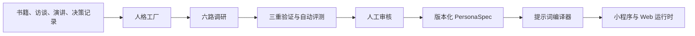

# 职乎：小程序产品决策记录

> 本文记录职乎从当前桌面端 Web 原型走向长期维护的微信小程序产品时，已经确认的产品、架构、隐私与发布决策。本文描述目标状态，不代表对应能力已经在当前代码中实现。

## 0. 文档信息

| 项目 | 内容 |
| --- | --- |
| 产品名称 | 职乎 |
| 目标形态 | 原生微信小程序主产品 + Web 展示与管理后台 |
| 产品阶段 | 从可运行 Web 原型进入产品化重构 |
| 首要目标 | 产品完整度、真实使用与传播、个人作品集表达 |
| 商业化 | 前期不收费，不以收入为核心目标 |
| 决策日期 | 2026-07-31 |
| 文档状态 | 已确认的产品基线；实现前仍需完成技术设计与合规核验 |

当前代码已经实现的能力、数据模型和限制，以 [职乎：产品与实现说明](./职乎-产品需求与交互设计.md) 为准。本文与现状不一致时，不应把本文中的规划能力描述为已实现。

## 1. 产品定位

### 1.1 一句话定位

职乎用三个经过验证的认知视角，帮助用户看清职业困境，并在需要时收束成决定或沟通方案。

### 1.2 核心用户

- 核心用户是工作 3–8 年，正在面对晋升、转岗、离职、跨团队协作、管理冲突或重要项目选择的职场人。
- 工作 0–3 年的用户通过更强的输入引导兼容，但不为其建设另一套独立产品。
- 产品不以专家型用户或 Prompt 工程用户为主，普通用户第一次进入时不需要理解模型、Agent、Skill 或提示词。

### 1.3 核心价值

职乎不是“名人聊天器”，也不让名人替用户做决定。人物名称是易于识别的入口，真正提供价值的是可追溯、可验证且彼此不同的认知镜片。

产品希望完成以下转变：

```text
一团混乱的职场困境
→ 三种互补但不强行统一的判断
→ 看见每条路径保护什么、牺牲什么
→ 用户自行选择继续探索、收束决定或准备沟通
```

核心叙事是：

> 用户不是得到一个标准答案，而是看见三种代价，最后把判断权拿回自己手里。

### 1.4 产品目标优先级

1. 用户能够真实完成一次有帮助的使用闭环。
2. 结果容易理解、保存和脱敏分享，形成自然传播。
3. 产品判断、交互审美、人格生产方法和隐私设计能够组成完整作品集故事。
4. 控制个人长期维护成本。
5. 前期不考虑付费；成本覆盖只作为运行约束，不作为产品方向。

## 2. 产品形态与渠道

### 2.1 主产品

- 最终分发形态为原生微信小程序。
- 不将当前 Next.js 页面直接包裹成小程序 WebView。
- 不以复用现有 UI 代码为目标；只复用经过验证的领域模型、内容资产、接口契约和设计语言。
- 小程序保留黑洞、卡牌和显影的品牌识别，但改为适合移动端性能的 Canvas、原生动画或轻量 CSS 实现。

### 2.2 Web 端

当前 Web 应用继续保留，并逐步转为：

- 产品官网和作品集展示；
- 更完整的沉浸式视觉体验；
- 人格工厂与内容管理后台；
- 调试、评测和版本管理入口。

### 2.3 主体与发布

- 公开提审前，以注册个体工商户作为目标方案。
- 现在不立即注册；先确认小程序实际服务类目、审核材料、经营范围和所在地登记要求。
- 注册主体的目的不是立即收费，而是降低长期发布、认证和能力接入的不确定性。
- 正式上线前需要完成小程序备案、隐私材料、AI 生成内容标识、模型备案或应用登记信息核验。

## 3. 核心体验

### 3.1 首次使用

普通用户无需先注册即可进入核心体验：

1. 输入一个真实职场困境。
2. 系统在后台判断用户更偏向探索、决策还是沟通。
3. 从 12 个内置视角中动态匹配 3 张互补卡。
4. 简短说明选择每张卡的原因。
5. 并行生成三个彼此独立的判断。
6. 用户自行决定下一步，不强迫立即得出结论。

只有在创建私有人格、消耗免费蒸馏额度或管理高级能力时，才要求微信登录。

### 3.2 三张卡的选择逻辑

默认始终使用三个稳定的功能槽位，但具体人物由系统动态选择：

| 槽位 | 作用 |
| --- | --- |
| 拆穿假设 | 识别叙述中未经验证的前提、情绪和盲区 |
| 计算路径 | 分析现实约束、风险、资源和可执行下一步 |
| 推动表达 | 帮助用户形成能说出口、能推进事情的表达 |

- 三个槽位保持互补，避免选出三个价值观和结论高度相似的人物。
- 系统推荐是默认路径，用户仍可以重新选择或手动替换人物。
- 当前 1–8 张自由组合能力不删除，可在 Web 深度模式或小程序的次级入口保留，但不是首页默认体验。

### 3.3 结果出口

三张卡之后不设置强制复盘或强制决策步骤。根据当前问题和用户行为，推荐但不强制以下出口：

- **帮我收束成决定**：整理用户当前倾向、关键依据、愿意承担的代价和下一步验证。
- **帮我准备怎么说**：生成适合真实沟通场景的表达草稿。
- **继续追问这个视角**：进入单张卡的独立对话。
- **到此为止**：直接保存或离开，不要求完成仪式化流程。

决策卡和沟通脚本都是重要结果，但不是每次使用的必经步骤。

### 3.4 历史与回声

- 历史记录保留。
- “历史回声”作为历史详情中的辅助功能，不作为首页主入口。
- 复盘应该在用户已经积累内容、产生回看需求时出现，不要求用户为了使用产品先学习一套复盘方法。
- 首版历史以本地保存为主，不建设普通明文云同步。

### 3.5 分享

- 分享是传播闭环的一部分，但默认只分享用户确认过的结果。
- 分享卡默认隐藏原始问题、姓名、公司、项目和具体数字。
- 用户应在预览页明确选择哪些内容可以公开。
- AI 生成内容标识必须在分享图、复制文本和导出内容中保留。

## 4. 内置视角

### 4.1 首发范围

当前 12 个视角全部进入首发目标，不按数量删减：

**人物认知镜片**

- 张一鸣
- 乔布斯
- Naval
- 张雪峰
- 芒格
- 塔勒布
- 曹操
- 任正非
- 张居正

**组织方法论**

- 阿里
- 字节
- 科大讯飞

### 4.2 命名与身份边界

- 人物卡统一称为“X 式视角”，明确标注“基于公开资料的 AI 框架推断，非本人观点或授权”。
- 组织卡称为“X 式组织视角”或对应方法论名称，不把企业拟人化为真实发言者。
- 不把人格质量等同于模仿口癖，不追求让用户误以为正在与本人对话。
- 关键内容区分公开原话、事实记录和框架推断。
- 人物姓名、图片、来源材料和输出方式在正式发布前需要完成权利与合规核验。

### 4.3 发布质量门槛

12 个视角可以同时首发，但不能继续只依赖当前的一段简短 `lens`。每个发布版本至少包含：

- 3–7 个核心心智模型；
- 5–10 条决策启发式；
- 表达 DNA；
- 价值观、反模式和诚实边界；
- 适用问题、不适用问题和主要盲区；
- 来源清单、研究日期和证据映射；
- 已知问题一致性测试；
- 未知问题的不确定性测试；
- 与其他内置视角的差异度测试；
- 人工审核记录和版本号。

## 5. Nuwa 蒸馏与人格系统

### 5.1 架构决策

[alchaincyf/nuwa-skill](https://github.com/alchaincyf/nuwa-skill) 作为人格研究与提炼方法论参考，不直接安装进线上用户请求链路。

Nuwa 适合承担离线或异步的“人格生产流水线”：

1. 从著作、访谈、表达、外部评价、决策记录和人生时间线六个维度采集材料。
2. 使用跨域复现、生成力和排他性验证候选心智模型。
3. 提取心智模型、决策启发式、表达 DNA、反模式和诚实边界。
4. 使用已知问题、未知问题和声音一致性测试验证质量。
5. 由人工审核后发布版本化人格。

线上问答链路保持简单，不启动 Claude Code、Codex CLI 或具有文件系统和 Shell 权限的通用 Agent。

### 5.2 人格工厂

第一阶段可以在开发环境中使用 Nuwa/Codex 离线生成 12 个内置人格的研究底稿，再人工校对。

第二阶段建设管理员使用的人格工厂：



建议使用 LangGraph.js 表达有状态、可恢复、支持人工审核的后台工作流。运行时模型调用不需要 Agent 框架。

### 5.3 PersonaSpec

人格工厂的最终资产不是 CLI Skill，而是应用原生、可校验和可版本化的 `PersonaSpec`：

```text
身份与显示信息
核心心智模型
决策启发式
表达 DNA
价值观与反模式
诚实边界
来源清单与研究日期
适用与不适用问题
评测用例与质量分数
提示词版本
```

每个发布人格至少生成：

```text
persona.json
runtime-prompt.md
sources.json
eval-cases.json
quality-report.json
```

卡牌创建时保存人格版本或完整运行快照，后续人格更新不能悄悄改写历史结果。

## 6. 用户私有人格

### 6.1 产品范围

用户可以创建仅自己可见的人格，但允许的蒸馏对象限定为：

- 公众人物；
- 历史人物；
- 用户本人；
- 用户已经获得明确授权的人；
- 不冒充具体个人的主题方法论。

不允许仅凭姓名搜索并蒸馏普通同事、熟人、未成年人或其他没有授权的非公众人物。

### 6.2 交付流程

私有人格通过异步任务生成：

```text
确认人物、用途与授权
→ 选择关注领域
→ 提供公开来源或用户有权使用的材料
→ 快速蒸馏任务排队
→ 调研、提炼和自动评测
→ 用户预览、修改与确认
→ 发布为仅自己可见的人格
```

- 每个账号前期提供 1 次免费快速蒸馏。
- 更多需求进入等待名单，不开放无限免费任务。
- 不生成人物声音克隆或仿真头像。
- 不长期保存不必要的整本书籍、完整音视频或其他受版权保护原文。
- 私有人格暂不进入公共市场或生成公开分享页。
- 后续可以评估 Markdown/JSON 私有导出，但导出不代表获得公开传播相关权利。

## 7. 隐私设计

### 7.1 目标承诺

目标隐私表述为：

> 职乎不把用户的原始问题、回答和个人决定用于运营查看或模型训练；默认不记录正文，保存的历史由用户控制。生成请求会在处理期间经过职乎服务和所选模型提供方。

不能承诺“开发者在技术上绝对不可能看到实时明文”，因为只要云端服务替用户调用模型，服务进程就必须在生成期间处理明文。

### 7.2 默认数据方案

- 提供默认无痕模式，生成完成后服务端不保存正文。
- 首版历史优先保存在用户设备。
- 如果后续增加云同步，必须先在客户端加密，服务端只保存密文。
- 运营后台不提供查看、搜索或导出用户对话的功能。
- 应用日志、APM、异常报告和模型追踪均禁止采集请求与回答正文。
- 只记录匿名请求 ID、模型、耗时、Token、状态码和错误分类等运行元数据。
- 分享、导出和复制由用户主动触发，并提供脱敏预览。
- 用户可以清空本地历史、删除账号和删除私有人格。

### 7.3 当前实现差距

当前 Web 原型会把问题、回答和用户决定以明文存入 SQLite。该实现只适合本地或受控演示环境，不能直接作为公开小程序的隐私架构。

公开发布前必须完成：

- 正文日志与模型追踪审计；
- 无痕模式；
- 本地历史存储设计；
- 数据删除与注销链路；
- 模型供应商数据留存条款核验；
- 隐私政策和第三方信息共享清单；
- 分享内容脱敏；
- AI 生成内容显式标识。

## 8. 自定义模型地址与 API Key

### 8.1 当前决策

当前阶段不做自定义 URL、用户 API Key 或 BYOK：

- 小程序不提供相关入口。
- Web 端暂不提供相关入口。
- 当前产品重构不建设通用模型代理、用户凭据保险库或任意模型连接测试。
- 不为了未来 BYOK 提前增加当前产品不需要的交互和基础设施复杂度。

### 8.2 未来评估条件

只有同时出现以下信号时才重新评估：

- 默认模型成本已经成为公开产品的主要限制；
- 有足够真实用户明确要求使用自己的模型额度；
- 默认模型体验和人格质量已经稳定；
- 团队有能力承担凭据安全、SSRF 防护、供应商兼容和支持成本。

重新评估不等于直接支持“任意 URL”。如未来实现，仍需限定为通过安全检查的公网 HTTPS 兼容端点。

## 9. 功能分层

| 层级 | 功能 |
| --- | --- |
| 小程序首发核心 | 游客提问、意图推断、动态三张卡、独立意见、选择原因、可选收束、可选沟通脚本 |
| 小程序保留 | 单卡追问、手动替换人物、本地历史、删除、导出、历史回声 |
| 小程序高级 | 微信登录、私有人格、一次免费快速蒸馏、任务进度与审核 |
| Web | 产品与作品集展示、完整视觉体验、人格内容后台 |
| 管理后台 | Nuwa 调研、来源审核、评测、版本发布和回滚 |
| 暂不建设 | BYOK、自定义模型 URL/API Key、人格公开市场、付费系统、无限蒸馏 |

现有功能不是被全部删除，而是根据移动端首要任务重新安排入口和优先级：

- 12 个内置视角全部保留并升级。
- 1–8 张自由组合可以保留在深度模式，不占据首次使用流程。
- 历史回声保留，但不作为一级入口。
- 自定义神明升级为有来源、评测和版本的私有人格。
- Three.js、音乐和全屏体验继续留在 Web 品牌展示，小程序使用轻量化表达。

### 9.1 已落地的移动端交互纵向切片

截至 2026-07-31，`apps/miniprogram` 已经把首页三卡闭环推进到可运行状态。实现采用“投入—凝结—显影—阅读—收束”五段式状态机：

- 长按事件视界完成问题收束，再启动三槽位匹配；
- 回答在后台并行生成，卡牌在完成前不泄露人物和正文；
- 第一次点击只显影身份，第二次点击经过卡牌放大消散过场进入全屏判词；
- 卡牌结果态不再保留黑洞，一屏只居中展示一张卡，左右滑动切换，点击后从原位置连续放大；
- 正文按原 Web 的“引言—判词—释义”层级重排，核心判断优先于完整解释；
- 全屏阅读允许在已显影卡牌间横向切换；
- 三卡全部显影后才出现行动判断与沟通话术，复盘不成为首页入口；
- 行动判断与沟通表达不得使用与问题无关的固定常量：真实模式通过无状态收束接口读取本轮问题和完成卡片，Mock 模式从本轮卡片正文提取行动句，并在界面明确标记“非模型生成”；
- 五套 Web 同源光谱在问题首次达到可提交长度时随机选定，并用 1.6 秒连续插值同步 Canvas 与 WXSS 色彩；提交沿用已选光谱，不发生二次跳色。三张卡从本轮主光谱向两侧各偏移约 34° 派生相邻色，不再固定绑定三套材质；光谱 ID 随本轮记录持久化，历史页据此形成可辨识的色彩序列，旧记录由问题文本稳定回填。纵向流体星云材质提供细丝和暗部层次，动态云气统一由 Canvas 负责，并用 `source-over` 暗尘遮挡补足加法光场缺少的深度排序；
- 凝结不再使用外圈几何匀速旋转的 spinner 范式：共享角速度弧线、固定射线、完整圆周辉光和环形向心粒子被删除；黑洞改为远侧盘、上下透镜像、偏心阴影与核心、近侧盘、局部光子环的前后遮挡结构，盘体由软边介质、21 条独立尘流和暗尘组成，附近星点同步发生轻量引力透镜；waiting、streaming、resolved 只单向推高核心温度，三张卡收束后黑洞才退场；
- 三个功能槽位各有独立卡牌材质，封印面使用多层几何和星图，身份面复用 Web 同源人物设计图并保留轨道、暗角与掠光；
- 动画使用轻量 WXSS，关键节点增加短震动，不引入 Three.js 或持续音频。
- 交互反馈不得依赖微信原生 Toast 或 Modal：卡片状态反馈留在卡面，提前松手由光环回弹和场景短句表达，历史删除/清空采用 3 秒行内二次确认；主动停止使用独立 `cancelled` 状态并允许轻触继续，不与生成失败共用视觉语义。
- 小程序衬线字统一使用 `Songti SC / STSong / Noto Serif CJK SC / Source Han Serif SC` 变量；全屏阅读横向切换要求横向位移至少为纵向 2.5 倍且限制纵向偏移，避免斜向滚动误翻页。

移动端界面不持续显示技术模式、生成数字、隐私口号或操作教程。必要的隐私边界保留在产品说明与历史页，主体验由封印亮度、翻牌、空间过场和触感反馈来传达状态。

首屏进一步采用“必要时才显现”的界面原则：英文品牌副标题与卡牌区英文标签删除；输入框只在聚焦时浮现极弱光场与焦点线，聚焦期间中文品牌微标和宣言退入背景；历史入口只对已有本地记录的空闲态用户开放；首次长按说明改为坠入事件视界的单颗微粒，完成一次提交后隐藏。首页根容器不再额外叠加安全区 padding，深空背景直接延伸到物理屏幕边缘。

这仍是产品纵向切片，但截至 2026-07-31 已新增 12 个 `0.1` 原型人格、三槽位动态匹配、选中理由、无状态真实模型流和单卡失败重试。尚未完成的是具备完整来源记录与回归评测的定稿人格资产、微信登录、分享卡，以及真实 AppID 下的真机兼容验证。当前人物图是作品集原型资产，不意味着人物本人授权或背书。

## 10. 目标技术架构

为方便个人长期维护，目标是少量清晰部署单元，而不是大量微服务：

```text
apps/miniprogram     原生微信小程序
apps/web             官网、作品展示与管理后台
services/api         用户、卡牌、模型网关与内容接口
services/worker      Nuwa 蒸馏、评测和异步任务

packages/persona     PersonaSpec 与提示词编译器
packages/contracts   前后端接口和共享类型
packages/evals       人格质量评测
```

基础设施目标：

- 托管 PostgreSQL，替换只适合单机原型的 SQLite；
- 对象存储保存必要的卡面和用户有权使用的材料；
- 一个在线 API 服务；
- 一个异步 Worker；
- 服务端密钥管理；
- 不采集正文的可观测性系统；
- 不引入 Kubernetes 或个人产品不需要的微服务复杂度。

## 11. 实施顺序

### 阶段 0：冻结设计

- 完成本决策记录。
- 编写小程序 PRD 和页面状态图。
- 定义 `PersonaSpec`、来源清单和评测格式。
- 完成隐私威胁模型与合规清单。

### 阶段 1：人格资产

- 使用 Nuwa 方法重建 12 个内置视角。
- 建立已知问题、未知问题、差异度和诚实边界评测。
- 完成首批人工审核和版本发布。

### 阶段 2：产品基础

- 建立小程序、API、Worker 和共享包结构。
- 迁移到适合公开服务的数据层。
- 实现游客体验、微信登录和无痕处理。

### 阶段 3：核心闭环

- 实现三槽位动态匹配。
- 实现三卡生成、选择原因和独立追问。
- 实现可选决策卡、沟通脚本、本地历史和脱敏分享。

### 阶段 4：私有人格

- 实现授权确认、材料输入、快速蒸馏队列。
- 实现用户预览、编辑、质量报告和私有发布。
- 落实每账号一次免费快速蒸馏与等待名单。

### 阶段 5：发布

- 核验服务类目和模型合规路径。
- 注册和认证发布主体。
- 完成隐私政策、用户协议、AI 标识和删除机制。
- 小范围内测，依据真实完成率、脚本使用率、分享率和反馈调整定位。

## 12. 明确不做

当前产品阶段明确不做：

- 自动替用户决定唯一正确答案；
- 强迫用户完成复盘、决策或沟通脚本；
- 把名人名称当作没有研究依据的 Prompt 皮肤；
- 公开发布用户生成的人格；
- 未经授权蒸馏非公众人物；
- 真人声音克隆和仿真头像；
- 用户自定义模型 URL、API Key 或 BYOK；
- 首期付费系统；
- 为追求“Agent 感”把通用 CLI Agent 放进在线请求链路；
- 把用户原始问题和回答提供给运营后台查看。

## 13. 尚需核验而非重新争论的事项

以下问题会影响实现细节，但不改变本决策记录中的产品方向：

- 微信小程序提审时适用的具体服务类目与材料；
- 个体工商户所在地的登记、经营范围和税务要求；
- 默认模型供应商的数据留存、训练和备案情况；
- 小程序本地历史容量、加密和清理策略；
- 12 个内置视角的姓名、卡面和来源使用边界；
- 免费蒸馏任务的实际模型成本和排队时长；
- 首次内测的量化目标与停止条件。
