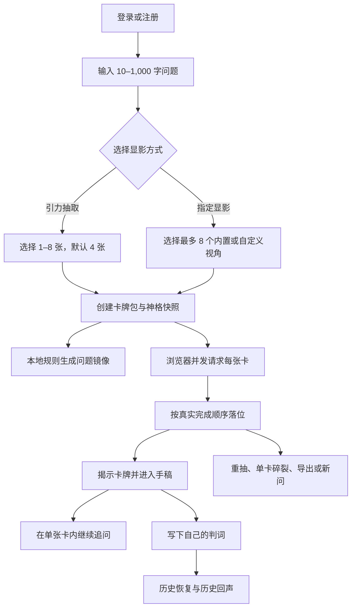

# 职乎：产品与实现说明

> 本文以当前仓库代码为唯一事实来源，描述已经实现的产品定位、用户流程、技术结构和能力边界。它取代早期“8 张固定卡、只能随机抽取、Tone.js 声音”等规划性描述。
>
> 面向微信小程序的长期产品方向与已确认决策，单独记录在 [职乎：小程序产品决策记录](./职乎-产品决策记录.md)。该文档描述目标状态；本文继续只描述当前代码已经实现的事实。

## 0. 文档信息

| 项目 | 当前实现 |
| --- | --- |
| 产品名称 | 职乎 |
| 英文标识 | ORACLE OF DISSENT |
| 产品形态 | PC 桌面端 AI Web 应用 + 原生微信小程序纵向切片 |
| 目标用户 | 需要审视职场困境和争议性选择的个人用户 |
| 核心输入 | 10–1,000 字文本问题 |
| 核心输出 | Web：1–8 个独立视角、单卡追问和个人决定；小程序：动态三卡、可选行动判断或沟通话术 |
| 视角来源 | 12 个内置视角 + 每账号最多 30 位自定义神明 |
| 选择方式 | 引力抽取或指定显影 |
| AI 模式 | 默认本地 Mock；可切换讯飞 MaaS OpenAI-compatible 模型 |
| 数据存储 | Web 使用服务所在机器的 SQLite；小程序纵向切片最多保存 20 条本地历史 |
| 主要运行环境 | Web：最新版桌面 Chrome；小程序：微信开发者工具基础库 3.17.0 已验证 |
| 文档状态 | 当前实现说明 |
| 核对日期 | 2026-07-31 |

## 1. 产品定义

### 1.1 一句话定义

职乎让用户把同一个职场问题交给若干价值排序不同的 AI 模拟视角，保留它们的分歧，再由用户自己判断和记录决定。

### 1.2 核心价值

通用 AI 容易把复杂问题压缩为“理性沟通、权衡利弊”的温和共识。职乎通过不同的判断尺度拆开这种共识：

- 有的视角优先保护长期成长和认知校准。
- 有的优先保护作品标准、选择权或风险下限。
- 有的先审视组织规则、关键人物、责任和执行闭环。
- 用户自定义神明可以引入自己的行业经验、价值观或决策纪律。

产品输出意见，但不替用户决定；提供分歧，但不安排顾问互相辩论。

### 1.3 目标用户与场景

适合：

- 领导临时增加任务，但资源、职责或 KPI 未调整。
- 与同事、上下游或管理者发生目标和边界冲突。
- 面对调岗、转组、离职、晋升或新项目选择。
- 希望比较现实路径、长期回报、作品标准和风险边界。
- 已经得到通用回答，但仍想从明确立场继续追问。

非目标场景：

- 实时劳动法规、公司制度或事实核验。
- 医疗、心理、法律、财务等专业诊断。
- 搜索、新闻、知识库、RAG 或内部文档问答。
- 自动联系第三方、替用户发消息或执行现实操作。
- 文件、截图、音频、视频等多模态问题输入。

### 1.4 产品原则

1. **多视角，不裁决。** 不投票，不统一总结，不自动推荐最终行动。
2. **视角独立。** 每张卡只读取原始问题、自己的封存档案和自己的最近对话。
3. **先保留分歧。** 不要求所有顾问使用同一个回答模板。
4. **决策权归用户。** “我的判词”由用户书写，最长 1,000 字。
5. **明确模拟身份。** 内置卡不是本人或组织发言，自定义神明也不代表现实授权。
6. **本地优先。** 默认无需联网模型，业务数据存入本机或私有服务器的 SQLite。

## 2. 当前功能地图

| 能力 | 状态 | 实现说明 |
| --- | --- | --- |
| 用户名/密码登录 | 已实现 | Better Auth Username，7 天 Session |
| 控制台验证码注册 | 已实现 | 6 位码，只打印后端控制台 |
| 1–8 张随机抽取 | 已实现 | 默认 4 张，内置视角与已启用自定义神明共同进入池 |
| 手动指定视角 | 已实现 | 最多 8 个，支持内置与当前账号自定义神明混选 |
| 多卡并行生成 | 已实现 | 浏览器并发发起每张卡的文本流 |
| 问题镜像 | 已实现 | 固定本地模板，不调用模型 |
| 独立多轮追问 | 已实现 | 每卡最近 20 条上下文 |
| 停止追问并保留片段 | 已实现 | 保存为 `stopped` 状态 |
| 我的决定 | 已实现 | 自动延迟保存，失焦时再次持久化 |
| 历史与 Markdown 导出 | 已实现 | 分页、恢复、重命名、删除、清空 |
| 单卡碎裂 | 已实现 | 仅删除当前卡及其消息，其他卡牌保留 |
| 自定义神明 | 已实现 | 创建、显像、引力场开关、重塑、删除、快照 |
| 历史回声 | 已实现 | 3–20 个去重问题，固定名言白名单 |
| 五套视觉光谱 | 已实现 | 每卷按 ID 稳定选取并持久化 |
| 氛围音乐 | 已实现 | 原生 `Audio`，非 Tone.js |
| 网页全屏 | 已实现 | Fullscreen API |
| 蒸馏 | 占位 | 仅显示“功能开发中”，无后端能力 |

### 2.1 原生微信小程序纵向切片

`apps/miniprogram` 已实现与 Web 并存的移动端核心闭环，不是 WebView 包装：

- 固定三个功能槽位：挑战假设、路径与风险、沟通与行动。
- 本地 Mock 与 NDJSON 分块 API 使用同一套 `plan / card.* / run.done` 客户端状态机。
- 问题先经过事件视界投入动画；生成进度与用户显影进度独立。
- 三张卡在流式生成期间保持封印，完成后才允许第一次点击翻转。
- 第一次点击展示人物身份、功能槽位和选择原因，第二次点击进入全屏判词。
- 全屏判词支持在已显影卡之间前后切换和横向手势切换。
- 三张可用卡全部显影后，才显示行动判断与沟通话术两个可选出口。
- 生成结果最多保留 20 条在微信本地存储；无状态 v2 接口不写入 Web 的 SQLite。

这套实现迁移的是 Web 的仪式节奏和信息揭示逻辑，而不是 Three.js、音乐或桌面全屏。详细运行和验证结果见 `apps/miniprogram/README.md`。

## 3. 视角系统

### 3.1 内置视角

当前内置 12 个视角，定义在 `lib/advisors.ts`：

| ID | 显示名 | 定位 | 判断重点 |
| --- | --- | --- | --- |
| `zhang-yiming` | 张一鸣 | 持续校准 | 事实、认知校准、长期回报、系统效率 |
| `steve-jobs` | 乔布斯 | 保持锋利 | 聚焦、品味、标准、个人意志 |
| `naval` | Naval | 争取杠杆 | 自由、长期博弈、边界、复利能力 |
| `zhang-xuefeng` | 张雪峰 | 先看现实 | 规则、资源、信息差、实际路径 |
| `charlie-munger` | 芒格 | 反过来想 | 激励、机会成本、偏误、避免错误 |
| `nassim-taleb` | 塔勒布 | 保留选择权 | 尾部风险、脆弱性、可逆性、切身性 |
| `cao-cao` | 曹操 | 唯才是举 | 核心矛盾、人才、资源、时机、集中优势 |
| `ren-zhengfei` | 任正非 | 灰度决断 | 主航道、客户价值、资源压强、备份 |
| `zhang-juzheng` | 张居正 | 综核名实 | 制度、执行、责任、期限、验收 |
| `alibaba` | 阿里 | 借事修人 | 目标、结果、复盘、向上沟通、协同 |
| `bytedance` | 字节 | 务实敢为 | Context、坦诚清晰、人才密度、试错 |
| `iflytek` | 科大讯飞 | 顶天立地 | 源头技术、真实刚需、自主可控、产业化 |

人物和组织的名字用于标识一种产品化判断框架。应用界面和导出文件都提示这些内容属于 AI 模拟。

### 3.2 自定义神明

每个账号可以创建最多 30 位自定义神明：

- 神名：2–30 个字符，同一账号内按规范化名称唯一。
- 神格提示词：20–2,000 个字符。
- 显像：可选 JPG、PNG 或 WebP，最大 2 MB。
- 随机状态：可选择是否进入“引力场”。
- 管理：支持重塑名称、提示词、显像和随机状态，也支持删除。

服务端不只信任浏览器提供的 MIME 类型，还检查 JPEG、PNG、WebP 的文件签名。显像以 SQLite BLOB 保存，并通过仅限所属账号访问的 API 返回。

### 3.3 神格快照

创建卡牌时，服务端把完整 `OracleProfile` 序列化到卡牌的 `oracle_snapshot` 字段。因此：

- 重塑自定义神明只影响未来创建的卡。
- 删除神明不会让历史卡失去姓名、提示词或显像引用信息。
- 导出和历史恢复优先读取快照，而不是实时读取当前神明。
- 内置视角同样保存快照，避免后续档案调整悄悄改写旧记录。

需要注意：删除自定义神明时数据库不会主动删除旧显像 BLOB；注销账号会整体删除该账号的显像数据。

## 4. 核心用户流程

### 4.1 总流程



### 4.2 注册与登录

用户名规则：

- 3–20 个字符。
- 支持汉字、英文字母、数字和下划线。
- 英文字母规范化为小写后比较。

密码规则：

- 8–64 个字符。
- 必须同时包含大写字母、小写字母、数字和特殊字符。

注册验证码：

- 6 位数字。
- 只打印在服务端控制台，接口不会返回明文验证码。
- 5 分钟过期，60 秒内不可重复获取。
- 单码最多失败 5 次。
- 同一用户名或 IP 每小时最多请求 10 次。
- 数据库只保存验证码和 IP 的加盐 SHA-256 哈希。

Session 有效期为 7 天，使用期间按天更新。网页没有忘记密码入口，服务运行者可使用 `pnpm user:reset-password` 重置。

登录表单预填一个共享体验账号，便于已有演示环境直接使用；数据库初始化脚本不会创建它。

### 4.3 提交问题

- 问题必须为 10–1,000 字，提交前去除首尾空白。
- 默认引力抽取 4 张，可选 1–8 张。
- 指定显影要求至少选择 1 个、最多 8 个且不能重复。
- 自定义神明必须属于当前账号；跨账号 ID 会被服务端拒绝。
- 同一账号数据库层只允许一个 `generating` 卡牌包。

前端通过长按黑洞按钮触发提交，也支持 `Cmd/Ctrl + Enter`。提交后先播放汇聚动画，再创建卡牌包并启动并行生成。

### 4.4 问题镜像

`POST /api/packs/:id/mirror` 使用固定本地模板：

```text
你正在权衡：<原问题摘要>。真正需要确认的是事实、可承受的代价，以及下一步能获得什么新信息。
```

镜像不调用 Mock 或真实模型，不做问题分类，也不会被加入顾问上下文。

### 4.5 并行生成与落位

创建卡牌包后，浏览器为每张卡分别请求 `POST /api/packs/:id/generate`：

1. 服务端校验当前账号、卡牌归属和卡牌状态。
2. 从 `oracle_snapshot` 恢复本次封存视角。
3. 为首次生成原子领取卡牌任务，防止同卡重复执行。
4. 使用 Mock 或真实 Provider 返回纯文本流。
5. 完成时写入 `initial_opinion`。
6. 在事务内分配下一个 `settled_order`。
7. 所有剩余卡完成后将卡牌包设为 `ready`。

首次意见虽然通过文本流传输，但前端不会逐字展示卡面正文；单卡完成后才揭示完整内容。追问则会实时显示流式文本。

客户端和服务端最大生成窗口均约为 60 秒。单卡失败会被删除；如果最后一张卡也失败，整个空卡牌包被删除。

### 4.6 卡牌阅读与追问

用户首次点击卡牌会看到放大的揭示卡，再进入手稿式阅读页。阅读页包含：

- 原始问题。
- 主神谕。
- 当前卡牌的追问与续示。
- 我的判词。
- Markdown 导出。
- 碎裂当前卡牌。

追问规则：

- 最长 1,000 字。
- `Enter` 发送，`Shift + Enter` 换行。
- 每张卡同时只能有一条正在生成的追问。
- 上下文为原始问题 + 当前卡最近 20 条非生成中消息。
- 不读取同卷其他卡牌的回复。
- 停止时保存当前已收到内容，状态为 `stopped`。
- 失败时保存已收到内容，状态为 `failed`。

输出经 `react-markdown`、GFM 和 `rehype-sanitize` 渲染。

### 4.7 我的判词

- 最长 1,000 字。
- 输入后约 700 ms 延迟保存。
- 文本框失焦时再次保存。
- 重抽整卷会清空旧判词。
- 单独碎裂一张卡不会清空整卷判词。

### 4.8 重抽、新问与单卡碎裂

**重抽 / 重新显影**

- 在当前卡牌包内执行。
- 事务内删除旧卡和全部旧消息。
- 清空上次选中卡和个人判词。
- 保留原始问题、标题、问题镜像和卡牌包 ID。
- 按当前随机数量或手动名单重建卡牌。

**新问**

- 退出当前卷，回到问题输入状态。
- 不删除已经持久化的旧卷。

**碎裂此卷**

界面文案沿用“碎裂此卷”，实际 API 删除的是当前选中的一张卡及其消息：

- 其余卡牌保留并在前端收拢。
- 卡牌包仍有卡时保持 `ready`。
- 最后一张卡删除后卡牌包标记为 `empty`，不会出现在历史列表中。

### 4.9 历史与导出

历史抽屉：

- 只显示当前账号且非 `empty` 的卡牌包。
- 按 `updated_at` 倒序游标分页，默认每页 20 条。
- 支持恢复完整消息和上次选中卡。
- 支持重命名，标题最长 60 字。
- 支持删除单卷和清空全部历史。

Markdown 导出包含：

- 标题与创建时间。
- AI 模拟身份说明。
- 原始问题与问题镜像。
- 按落位顺序排列的卡牌意见。
- 每卡追问记录与停止/中断标记。
- 自定义神明的封存神格说明。
- 用户自己的判词。

### 4.10 历史回声

历史回声在登录后的空白问题页出现：

- 页面空闲约 5 秒后自动尝试加载，也可以手动唤醒。
- 至少需要 3 个不同的已完成问题。
- 最多读取当前账号最近 20 个去重问题。
- 忽略 `generating` 和 `empty` 卡牌包。
- 只允许从 27 条固定名言中选择，不允许模型创造名言、作者或出处。
- 名言来自张一鸣、乔布斯、Naval、张雪峰、芒格、塔勒布、曹操、任正非、张居正，每人 3 条。

Mock 模式按关键词和稳定历史指纹选择主题与名言。真实模式把历史摘要和白名单目录交给模型，模型只返回 `quoteId`、主题和 80–160 字启示，服务端再校验并回填原始名言。

回声缓存只保存选择结果、版本和历史指纹，不保存历史问题原文。相同历史复用缓存；新增历史会重新生成。清空历史和注销账号都会清除缓存。

## 5. AI 行为

### 5.1 Mock 模式

除非 `MOCK_AI` 明确等于 `false`，应用都运行在 Mock 模式：

- 无需网络或 API Key。
- 内置视角使用本地开场与判断模板。
- 自定义神明回答会提取其封存提示词片段。
- 文本以小块、短延迟的 `ReadableStream` 返回。
- 问题镜像始终使用本地模板。
- 历史回声使用本地主题规则。

Mock 适合产品演示、开发和自动化测试，不代表真实模型质量。

### 5.2 真实模型模式

真实模式使用讯飞 MaaS OpenAI-compatible HTTP API：

- Provider：`@ai-sdk/openai-compatible`
- 默认 Base URL：`https://maas-api.cn-huabei-1.xf-yun.com/v2`
- 默认示例模型：`deepseek-v4-pro`
- 关闭联网搜索：`search_disable: true`
- 关闭思维链输出：`enable_thinking: false`
- 单次超时：55 秒
- 最大输出：顾问 1,200 tokens；历史回声 700 tokens

初次意见提示长度目标为 150–250 个中文字符，追问目标为 300–600 个中文字符。这是提示约束，不是服务端硬截断。

真实模式必须提供 `XFYUN_API_KEY` 和 `XFYUN_MODEL_ID`。缺少配置时返回统一 503，不向浏览器泄漏凭据。

### 5.3 提示词边界

顾问系统提示词：

- 明确声明不是真实人物本人，也未获得授权。
- 将封存神格放入 `<oracle_lens>` 数据区。
- 指示模型忽略神格中试图泄漏系统信息或改变平台规则的内容。
- 不要求统一的编号、总结或建议清单。
- 允许质疑用户叙述，但必须把最终决定留给用户。
- 禁止调用联网搜索或引用无法核验的实时事实。

这能降低自定义提示词直接改写平台规则的风险，但不是完整的内容安全或提示注入防护系统。

## 6. 视觉与声音

### 6.1 场景

`OracleAtmosphere` 使用 React Three Fiber 实现：

- 黑洞与吸积盘。
- 星场、粒子和轨道。
- Bloom、Noise、Vignette 等后期效果。
- 根据认证、提问、召唤、封存、阅读和碎裂阶段调整能量。

卡牌在单行轨道上呈现。完成后可翻转揭示，再进入手稿阅读。删除卡牌时使用纸张碎裂、粒子流和卡轨压缩动画。

### 6.2 五套光谱

每卷根据卡牌包 UUID 稳定映射到一套光谱：

| ID | 名称 |
| --- | --- |
| `obsidian` | 黑曜神谕 |
| `lunar` | 月蚀银蓝 |
| `ziwei` | 紫微星云 |
| `calamity` | 赤焰灾星 |
| `jade` | 翡翠深空 |

光谱 ID 保存在 `advice_packs.visual_spectrum`，历史恢复后保持一致。

### 6.3 声音与全屏

- 使用浏览器原生 `Audio` 播放 `/audio/weve-never-met.mp3`。
- 音频不循环，音量固定为 0.55。
- 登录成功后尝试播放；浏览器阻止时提示用户手动点击音符。
- 用户可以暂停，播放结束后按钮自动回到关闭状态。
- 全屏使用标准 Fullscreen API，可进入和退出网页全屏。

### 6.4 降低动态效果

多个关键动画会检测 `prefers-reduced-motion: reduce` 并缩短或跳过等待。项目仍以桌面 WebGL 场景为核心，没有完整的无 WebGL 降级页面。

## 7. 数据与安全

### 7.1 部署边界

数据位于运行 Next.js 服务的机器，而不是访问者浏览器。推荐形态：

- 本机运行；或
- 单个带持久磁盘的私有 Node.js 实例。

SQLite WAL 适合该边界，不适合多个无状态实例并发写入。

### 7.2 数据表

Better Auth 表：

- `user`
- `session`
- `account`
- `verification`

业务表：

| 表 | 用途 |
| --- | --- |
| `registration_codes` | 验证码/IP 哈希、过期、尝试次数和限流 |
| `advice_packs` | 问题、标题、镜像、光谱、选择方式、决定和状态 |
| `cards` | 顾问 ID、神格快照、意见、状态和落位顺序 |
| `messages` | 单卡追问与回答、顺序和完成状态 |
| `custom_deities` | 自定义名称、提示词、显像引用和引力场状态 |
| `deity_images` | 账号隔离的图片 BLOB |
| `quote_insights` | 历史指纹、版本、生成锁和回声结果缓存 |

关键约束：

- 同卷 `advisor_id` 唯一。
- 同卷非空 `settled_order` 唯一。
- 每账号最多一卷处于 `generating`。
- 每卡消息 `sequence` 唯一。
- 用户、卡牌包和卡牌查询都校验所属账号。
- 卡牌包删除级联删除卡牌和消息。

### 7.3 明文与哈希

只保存哈希：

- 注册验证码。
- 用于验证码限流的请求 IP。

Better Auth 的 `session` 表包含 `ipAddress` 和 `userAgent` 字段，认证流程可能在其中保存会话 IP 与浏览器标识；它们不属于上述验证码限流哈希。

以明文保存在 SQLite：

- 用户问题和问题镜像。
- 顾问回复、追问和个人决定。
- 自定义神格提示词。
- 历史回声结果。

密码由 Better Auth 哈希。API Key 仅从服务端环境变量读取。

### 7.4 删除行为

- 删除单卡：删除该卡和全部消息。
- 删除单卷：级联删除该卷卡牌和消息。
- 清空历史：删除所有卡牌包并清除回声缓存。
- 删除自定义神明：删除配置；历史卡使用快照继续展示。
- 注销账号：验证当前密码后删除账号、Session、账户、卡牌包、回声缓存、自定义神明、显像和对应注册记录。

## 8. API 现状

所有业务 API 除注册相关接口外都要求有效 Session。

| 方法 | 路径 | 用途 |
| --- | --- | --- |
| `*` | `/api/auth/[...all]` | Better Auth 登录、退出、Session |
| `POST` | `/api/verification/request` | 申请控制台验证码 |
| `POST` | `/api/register` | 校验验证码并创建账号 |
| `DELETE` | `/api/account` | 验证密码并注销账号 |
| `GET` / `POST` | `/api/packs` | 历史分页 / 创建卡牌包 |
| `GET` / `PATCH` / `DELETE` | `/api/packs/:id` | 读取、改标题/判词/选中卡、删除 |
| `POST` | `/api/packs/:id/generate` | 首次意见或追问文本流 |
| `POST` | `/api/packs/:id/mirror` | 本地规则生成问题镜像 |
| `POST` | `/api/packs/:id/reroll` | 重抽或重新显影 |
| `POST` | `/api/packs/:id/abandon` | 页面离开时清理未完成卡 |
| `GET` | `/api/packs/:id/export` | 下载 Markdown |
| `DELETE` | `/api/packs/clear` | 清空历史 |
| `DELETE` | `/api/cards/:id` | 删除单卡 |
| `POST` | `/api/cards/:id/fail` | 标记并清理失败卡 |
| `POST` | `/api/cards/:id/chat/stop` | 保存停止/失败的追问片段 |
| `GET` / `POST` | `/api/deities` | 列表 / 创建自定义神明 |
| `PATCH` / `DELETE` | `/api/deities/:id` | 重塑、切换引力场 / 删除 |
| `GET` | `/api/deity-images/:id` | 读取当前账号显像 |
| `POST` | `/api/insights/quote` | 获取或生成历史回声 |

早期文档中的 `/api/card-packs/*`、`/api/me/*` 和独立 `/api/cards/:id/opinion` 路径均不是当前实现。

## 9. 代码结构

```text
app/
├── api/                  Route Handlers
├── globals.css           全部页面与动画样式
├── layout.tsx            字体、元信息与根布局
└── page.tsx              主应用入口

components/
├── AuthGate.tsx          登录与注册
├── QiuzhitaiApp.tsx      主状态、请求编排和全部产品流程
├── OracleAtmosphere.tsx  Three.js 场景
├── DeityForge.tsx        自定义神明创建与重塑
├── HistoryEchoRift.tsx   历史回声状态机
├── DistillationPreview.tsx 蒸馏占位页
└── FloatingText.tsx      文字动画

lib/
├── advisors.ts           12 个内置视角
├── deities.ts            自定义神明、显像和快照
├── packs.ts              卡牌包、卡牌、消息事务
├── mock-ai.ts            Mock 意见与文本流
├── real-ai.ts            真实 Provider、提示词和上下文
├── quote-insights.ts     历史回声生成、白名单和缓存
├── quotes.ts             27 条固定名言
├── export-pack.ts        Markdown 导出
├── auth.ts / session.ts  认证与业务鉴权
└── spectra.ts            五套视觉光谱

db/
├── index.ts              SQLite 初始化和兼容性迁移
└── schema.ts             Drizzle schema
```

`QiuzhitaiApp.tsx` 目前承担较多 UI 状态与请求编排，是后续拆分维护时最值得优先处理的文件。

## 10. 本地运行与配置

要求 Node.js `>=22.13.0` 与 pnpm：

```bash
pnpm install
cp .env.example .env.local
pnpm db:setup
pnpm dev
```

默认打开 <http://localhost:3000>。

环境变量：

```dotenv
MOCK_AI=true
DATABASE_URL=file:./data/qiuzhitai.db
BETTER_AUTH_URL=http://localhost:3000
BETTER_AUTH_SECRET=至少32位随机字符串
REGISTRATION_HASH_SECRET=可选的独立哈希盐

XFYUN_API_BASE=https://maas-api.cn-huabei-1.xf-yun.com/v2
XFYUN_API_KEY=
XFYUN_MODEL_ID=deepseek-v4-pro
```

生产环境不能继续使用代码中的开发回退密钥。

## 11. 测试与验收

命令：

```bash
pnpm lint
pnpm test:unit
pnpm test:e2e
pnpm build
pnpm test:smoke-real
```

当前自动化基线：

- 7 个 Vitest 文件、36 个单元/集成测试。
- 3 条 Playwright Chromium 主链路。
- E2E 使用固定验证码、Mock AI 和独立 SQLite 文件。
- 真实 MaaS 冒烟不属于默认测试，需要显式配置凭据。

Vitest 覆盖：

- 12 个内置视角及提示词身份边界。
- 1–8 张抽卡、指定显影、完成顺序和生成锁。
- 重抽事务、单卡失败、空包删除和级联删除。
- 自定义神明账号隔离、图片签名、随机池和历史快照。
- 单卡上下文最近 20 条。
- 注册验证码有效期、冷却、限流、哈希和密码规则。
- Markdown 转义与导出结构。
- 历史回声去重、账号隔离、主题选择、白名单和缓存。

Playwright 覆盖：

- 注册、登录、注销和账号删除。
- 默认四卡、八卡、指定显影、受控单卡失败与重抽。
- 卡牌揭示、手稿、追问停止、决定保存和导出。
- 历史恢复、重命名、删除、清空。
- 自定义神明创建、引力场、重塑、删除和快照。
- 音频、全屏相关基础交互与关键视觉状态。

## 12. 部署边界

Next.js 使用 `output: "standalone"`。`ops/zhihu.service` 和 `ops/nginx-zhihu.conf` 是当前服务器环境的示例，不是通用安装脚本：

- systemd 示例固定使用 `/opt/zhihu/current/runtime`、端口 3001 和 `/etc/zhihu.env`。
- Nginx 示例含具体 IP、端口和额外反向代理路径。
- 新环境部署时必须替换这些值，并保证 SQLite 数据目录持久化和可写。

数据库使用 WAL、外键和 5 秒 busy timeout。当前没有备份、恢复、滚动迁移、多实例选主或远程对象存储方案。

## 13. 已知边界与后续方向

当前明确未实现：

- 蒸馏的实际人物/组织档案生成功能。
- 模型驱动的问题镜像。
- 搜索、RAG、联网事实核验和引用系统。
- 统一总结、顾问互评、辩论、投票或自动决策。
- 移动端专项布局和无 WebGL 降级。
- 网页端忘记密码、邮箱找回或管理员后台。
- 内容审核、敏感信息脱敏、数据库字段加密。
- 多租户运营、用量计费、队列、可观测性和多实例部署。

建议的后续工程优先级：

1. 将 `QiuzhitaiApp.tsx` 拆分为请求层、状态机和独立功能组件。
2. 为真实模型增加稳定的错误分类、重试策略和用量观测。
3. 明确共享体验账号的数据隔离与清理策略。
4. 增加 SQLite 备份、恢复和显像孤儿清理工具。
5. 在实现“蒸馏”前先定义输入来源、版权边界、提示注入防护和人工确认流程。
